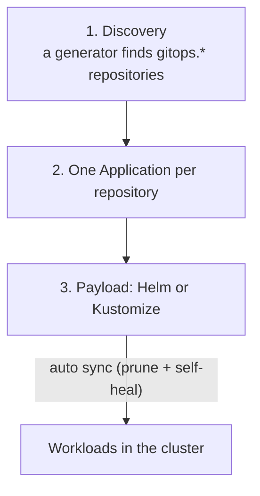

# GitOps pattern

A `git push` to the main branch of a `gitops.*` repository **is** the deploy. There is no manual `kubectl apply`
and no deploy step inside CI.

## The three layers

1. **Discovery.** An `ApplicationSet` queries the organisation and creates one Application per repository
   matching the `gitops.` prefix. A new repository joins on its own, with no central edit.
2. **Per repository.** Each repo declares what it ships. One workload per repo is the common case; more than
   one component needs explicit declarations.
3. **Payload.** What gets applied: usually a thin chart depending on a **generic app chart** with safe defaults.

## From commit to pod

Each app's CI builds and publishes the image. An *image updater* writes the new tag into the GitOps repository
and the controller syncs. CI never talks to the cluster.

## Trade-offs

- (+) Auditable, reversible with `git revert`, no cluster credentials in CI.
- (+) Auto-heal removes manual drift.
- (−) Changes to a shared addon have a cluster-wide blast radius.
- (−) Consumers of the generic chart only get changes by bumping the dependency version: safe, but it takes
  discipline.
