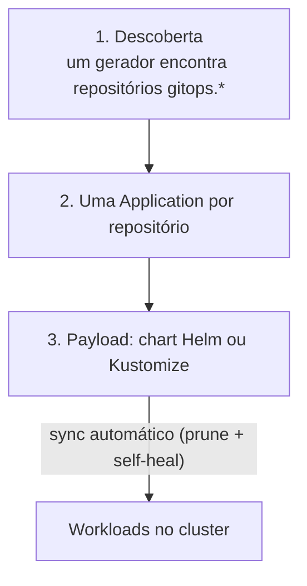

# Padrão GitOps

Um `git push` na branch principal de um repositório `gitops.*` **é** o deploy. Não há `kubectl apply`
manual nem passo de deploy dentro do CI.

## As três camadas

1. **Descoberta.** Um `ApplicationSet` consulta a organização e cria uma Application por repositório que
   case com o prefixo `gitops.`. Repositório novo entra sozinho, sem editar nada central.
2. **Por repositório.** Cada repo declara o que entrega. Um workload por repo é o caso comum; mais de um
   componente exige declarações explícitas.
3. **Payload.** O conteúdo aplicado: normalmente um chart fino que depende de um **chart genérico de apps**
   com defaults seguros.

## Do commit ao pod

O CI de cada app constrói e publica a imagem. Um *image updater* escreve a nova tag no repositório GitOps e o
controlador sincroniza. O CI nunca fala com o cluster.

## Trade-offs

- (+) Auditável, reversível com `git revert`, sem credenciais de cluster no CI.
- (+) Auto-heal remove drift manual.
- (−) Mudanças em um addon compartilhado têm raio de impacto de cluster inteiro.
- (−) Consumidores do chart genérico só recebem mudanças ao subir a versão da dependência, o que é
  seguro, mas exige disciplina.
