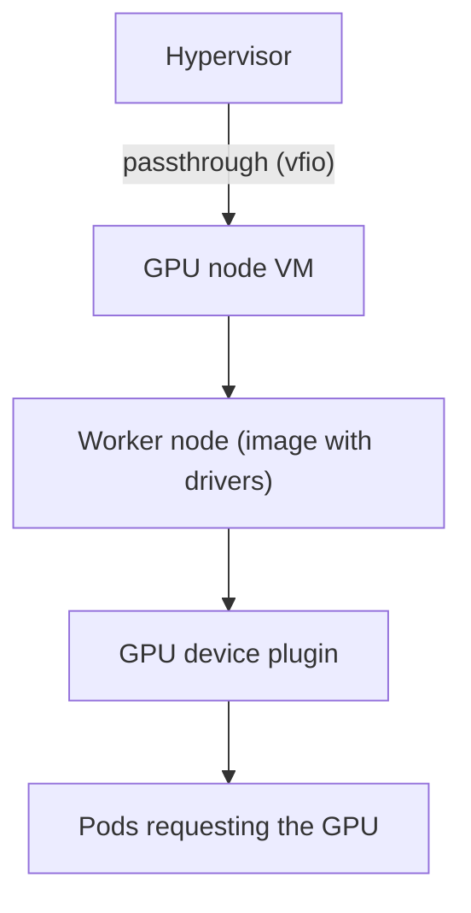

# GPU in the cluster

A consumer GPU runs computer-vision and local-LLM workloads inside the same cluster.

## The recipe, in steps

1. **IOMMU on** in firmware and in the host kernel.
2. **Unbind the GPU from the host**: vfio-pci, a blocklist for the graphics drivers and an initramfs rebuild.
3. **Dedicated VM**, not sharing the GPU with host containers. Secure Boot off in the VM's firmware; a
   "boot access denied" error is almost always this forgotten step.
4. **OS image with extensions** for the driver and container runtime, at the cluster's exact version.
5. **Device plugin** installed through the same GitOps mechanism as other addons, not loose manifests.

## Lessons

- Host kernel updates can break the proprietary driver build: pin a stable kernel series.
- A VM for the GPU node is the justified exception to "containers before VMs".

## Trade-offs

- (+) One GPU serves the whole cluster with VM-level isolation.
- (−) The GPU is tied to the VM; the host can't use it.
- (−) An OS or driver upgrade means rebuilding the image.
