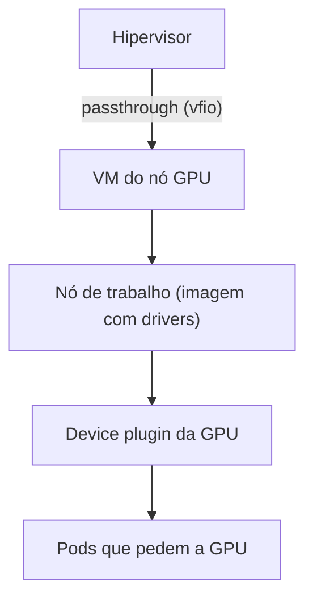

# GPU no cluster

Uma GPU de consumo roda cargas de visão computacional e de LLM local dentro do mesmo cluster.

## Receita, em passos

1. **IOMMU ligado** no firmware e no kernel do hospedeiro.
2. **Desvincular a GPU do hospedeiro**: vfio-pci, lista de bloqueio dos drivers gráficos e regeneração do initramfs.
3. **VM dedicada**, sem dividir a GPU com contêineres do hospedeiro. Secure Boot desligado no firmware da VM; o erro
   "boot access denied" quase sempre é esse passo esquecido.
4. **Imagem do sistema com extensões** de driver e de runtime de contêiner, na versão exata do cluster.
5. **Device plugin** instalado pelo mesmo mecanismo GitOps dos outros addons, não por manifests avulsos.

## Lições

- Atualizações do kernel do hospedeiro podem quebrar a compilação do driver proprietário: fixe uma série de kernel
  estável.
- Uma VM para o nó GPU é a exceção justificada a "contêiner antes de VM".

## Trade-offs

- (+) Uma GPU serve o cluster inteiro com isolamento de VM.
- (−) A GPU fica presa à VM; o hospedeiro não a usa.
- (−) Upgrade de sistema ou de driver exige reconstruir a imagem.
