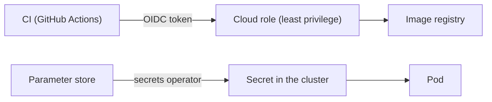

# Identity and secrets

Goal: **no long-lived credential copied by hand**.

## Two flows

- **CI → cloud:** the pipeline exchanges the Git provider's OIDC token for a temporary role. No access key is
  stored in the repository.
- **Cluster → secrets:** an operator syncs values from a managed store into Kubernetes `Secret`s. The repository
  only holds the *reference* to the secret, never the value.

## Principles

- Least privilege per repository and per function.
- Rotation happens in the store; pods get the new value with no code change.
- Bootstrap secrets, which cannot come from the cluster, are the explicit exception and stay out of Git.

## Trade-offs

The store becomes a runtime dependency and the secrets operator a critical piece. In return, secrets disappear
from CI and from manifests.
