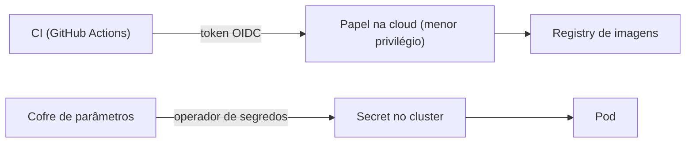

# Identidade e segredos

Objetivo: **nenhuma credencial de longa duração copiada à mão**.

## Dois fluxos

- **CI → cloud:** o pipeline troca o token OIDC do provedor de Git por um papel temporário. Não existe chave
  de acesso guardada no repositório.
- **Cluster → segredos:** um operador sincroniza valores de um cofre gerenciado para `Secret`s do Kubernetes.
  O repositório guarda apenas a *referência* ao segredo, nunca o valor.

## Princípios

- Menor privilégio por repositório e por função.
- Rotação acontece no cofre; os pods recebem o valor novo sem mudança de código.
- Segredos de bootstrap, que não podem vir do cluster, são a exceção explícita e ficam fora do Git.

## Trade-offs

O cofre vira dependência de runtime e o operador de segredos é peça crítica. Em troca, desaparecem os segredos
em CI e em manifests.
