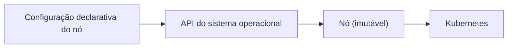

# Cluster em sistema imutável

O cluster Kubernetes roda em **Talos Linux**: um sistema sem shell, sem SSH e sem gestor de pacotes, configurado
inteiramente por uma API declarativa.

## O que muda na operação

- **Nó é gado, não bicho de estimação.** Para mudar um nó, muda-se a configuração e aplica-se; não se entra nele.
- **Mesma imagem, hardware diferente.** O cluster mistura placas ARM pequenas e uma máquina x86 com GPU, todas
  gerenciadas do mesmo jeito.
- **Extensões entram na imagem**, não por instalação manual. Drivers de GPU, por exemplo, são extensões de sistema
  escolhidas na construção da imagem.

## Trade-offs

- (+) Superfície de ataque menor e estado do nó reproduzível.
- (+) Atualizar o sistema operacional é uma operação de API, com rollback.
- (−) Sem SSH para "dar um jeito": todo diagnóstico passa por API e logs.
- (−) Curva de aprendizado e alguns detalhes específicos de VM (nomes de interface, firmware) que só se aprendem
  uma vez.
- (−) Armazenamento lento em nós pequenos pede disciplina: workloads que escrevem muito não vão para eles.
