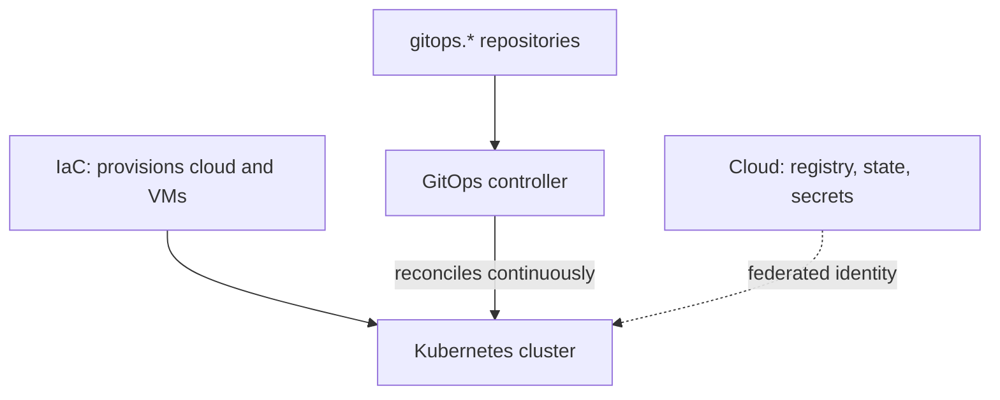

# Architecture overview

The platform has four layers, each with one clear tool and owner.

| Layer | Responsibility | Tool (type) |
|---|---|---|
| Provisioning | Cloud resources and VMs | Terraform/Terragrunt |
| Cluster | Operating system and Kubernetes | Immutable, API-driven distribution |
| Delivery | Getting Git state into the cluster | GitOps controller (Argo CD) |
| Applications | Each app's code and image | Per-repository CI |

Compute is hybrid: the cluster runs on owned hardware, and what is worth managed (image registry, IaC state,
secret storage) lives in the cloud.

**Golden rule:** only the delivery layer changes cluster state. Provisioning and bootstrap are triggered
manually; from the GitOps controller onwards everything is continuously reconciled and any drift is reverted.

Patterns in detail: [GitOps](gitops-pattern.md), [identity and secrets](identity-and-secrets.md),
[two-tier IaC](two-tier-iac.md).
