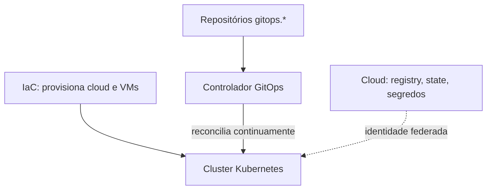

# Visão geral da arquitetura

A plataforma tem quatro camadas, cada uma com uma ferramenta e um dono claros.

| Camada | Responsabilidade | Ferramenta (tipo) |
|---|---|---|
| Provisionamento | Recursos de cloud e VMs | Terraform/Terragrunt |
| Cluster | Sistema operacional e Kubernetes | Distribuição imutável, API-driven |
| Entrega | Levar o estado do Git ao cluster | Controlador GitOps (Argo CD) |
| Aplicações | Código e imagem de cada app | CI próprio por repositório |

O compute é híbrido: o cluster corre em hardware próprio, e o que compensa ser gerenciado
(registry de imagens, state de IaC, armazenamento de segredos) fica na cloud.

**Regra de ouro:** só a camada de entrega muda o estado do cluster. Provisionamento e bootstrap são
disparados manualmente; do controlador GitOps em diante, tudo é reconciliado continuamente e qualquer
divergência é revertida.

Veja os padrões em detalhe: [GitOps](gitops-pattern.md), [identidade e segredos](identity-and-secrets.md),
[IaC em dois níveis](two-tier-iac.md).
