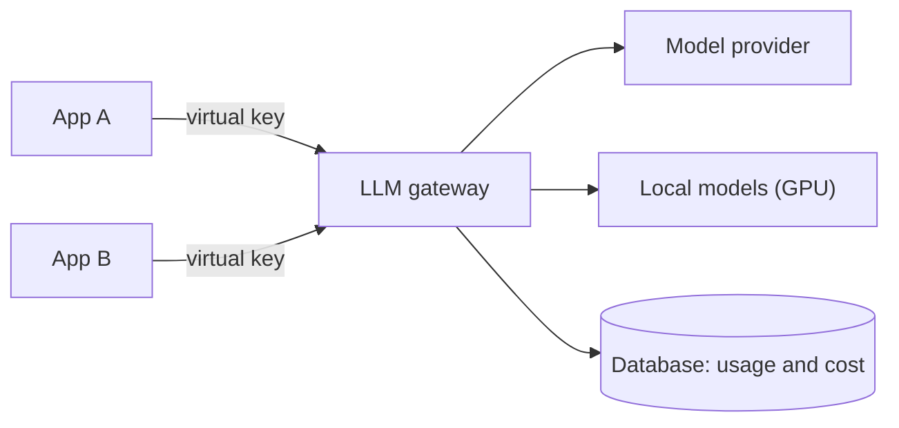

# LLM gateway

Applications don't talk to the model provider directly: they go through a **self-hosted gateway**.

## What the gateway solves

- **Provider keys in one place**, delivered as a secret; apps only get virtual keys.
- **Per-application cost**: each virtual key has its usage measured and capped.
- **Swapping provider or model** without changing app code; local models enter through the same point.
- An app only needs a base address internal to the cluster.

## Trade-offs

- (+) Cost and credential governance without rewriting applications.
- (−) The gateway becomes a single point of failure and needs its own database.
- (−) One more layer of latency and maintenance.
- Development AI tooling stays outside it, on its own plan.
