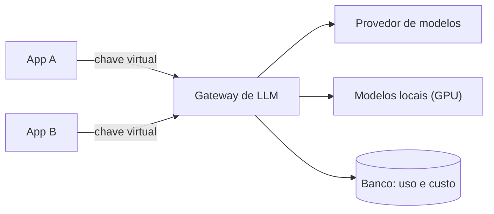

# Gateway de LLM

As aplicações não falam com o provedor de modelos diretamente: passam por um **gateway auto-hospedado**.

## O que o gateway resolve

- **Chaves do provedor em um só lugar**, entregues como segredo; as apps recebem apenas chaves virtuais.
- **Custo por aplicação**: cada chave virtual tem seu consumo medido e limitável.
- **Troca de provedor ou modelo** sem mudar o código das apps; modelos locais entram pelo mesmo ponto.
- A app só precisa de um endereço base interno ao cluster.

## Trade-offs

- (+) Governança de custo e de credenciais sem reescrever aplicações.
- (−) O gateway vira um ponto único de falha e precisa de banco próprio.
- (−) Uma camada a mais de latência e de manutenção.
- Ferramentas de IA de desenvolvimento ficam fora dele, com o próprio plano.
