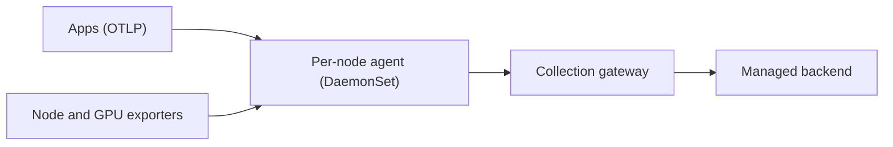

# Observability

A **managed** backend (no self-run Mimir/Loki/Tempo) and lightweight agents in the cluster.

## Design

- A **per-node agent** receives app telemetry (OTLP) and collects local metrics and logs.
- A **single gateway** funnels everything to the backend, on a stable node with reliable disk.
- **Dashboards as code**, as JSON in the repository.
- Own apps are instrumented with the OpenTelemetry SDK; profiling only where it matters.

## Allowlist, not denylist

Metric collection is **explicit**: only what has an owner and a use gets in. We started with "collect everything
and exclude the noise" and blew through the free tier's active-series limit. Every new scrape is now additive and
justified.

## Hardware constraints

Nodes with SD cards suffer write wear: heavy logs and metrics don't live on them. eBPF-based instrumentation was
deferred because of its cost on weak ARM CPUs.

## Trade-offs

- (+) Zero operations for metrics, logs and traces storage.
- (−) Dependency on an external service and its plan limits.
- (−) Alerts and dashboards still need their own process to land via Git.
