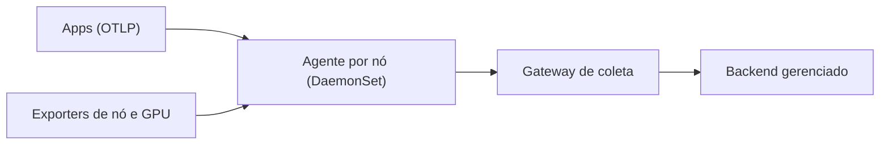

# Observabilidade

Um backend **gerenciado** (sem Mimir/Loki/Tempo próprios) e agentes leves no cluster.

## Desenho

- **Agente por nó** recebe telemetria das apps (OTLP) e coleta métricas e logs locais.
- **Gateway único** concentra o envio ao backend, num nó estável e com disco confiável.
- **Dashboards como código**, em JSON no repositório.
- Apps próprias são instrumentadas com o SDK OpenTelemetry; profiling só onde importa.

## Allowlist, não denylist

A coleta de métricas é **explícita**: só o que tem dono e uso entra. Começamos com "coletar tudo e excluir o
ruído" e estouramos o limite de séries ativas do plano gratuito. Hoje cada scrape novo é aditivo e justificado.

## Restrições de hardware

Nós com cartão SD sofrem desgaste de escrita: logs e métricas pesados não ficam neles. Instrumentação por eBPF foi
adiada pelo custo em CPUs ARM fracas.

## Trade-offs

- (+) Zero operação de armazenamento de métricas, logs e traces.
- (−) Dependência de um serviço externo e dos limites do plano.
- (−) Alertas e dashboards ainda precisam de processo próprio para entrar via Git.
