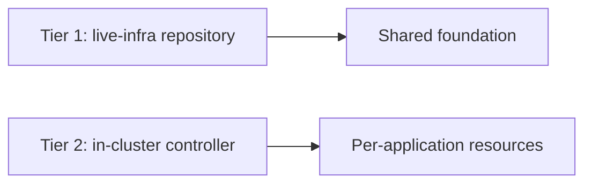

# Two-tier IaC

Infrastructure as code is split into two tiers with **disjoint boundaries**.

| Tier | Scope | How it runs |
|---|---|---|
| **Tier 1** | Foundation: identity, registry, network, VMs | Terragrunt in a pipeline, plan on PR, gated apply |
| **Tier 2** | Resources owned by one application | Reconciled from inside the cluster by a Terraform controller |

## The rule that prevents disasters

The two tiers **never** point at the same layer or state. If they did, each would try to reconcile what the other
created.

## Trade-offs

- (+) An application owner can request infrastructure without touching the foundation.
- (+) The foundation apply stays behind human review.
- (−) Two ways of running Terraform to understand and maintain.
