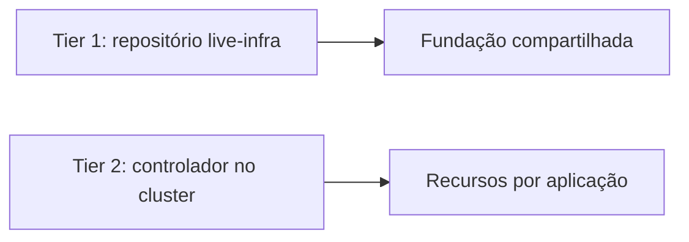

# IaC em dois níveis

Infraestrutura como código é dividida em dois níveis com **fronteiras disjuntas**.

| Nível | Escopo | Como roda |
|---|---|---|
| **Tier 1** | Fundação: identidade, registry, rede, VMs | Terragrunt em pipeline com plano em PR e apply com aprovação |
| **Tier 2** | Recursos que pertencem a uma aplicação | Reconciliado de dentro do cluster por um controlador de Terraform |

## Regra que evita desastres

Os dois níveis **nunca** apontam para o mesmo layer ou state. Se apontassem, cada um tentaria reconciliar o que o
outro criou.

## Trade-offs

- (+) Quem é dono da aplicação consegue pedir infraestrutura sem tocar a fundação.
- (+) O apply da fundação fica atrás de revisão humana.
- (−) Duas formas de rodar Terraform para entender e manter.
