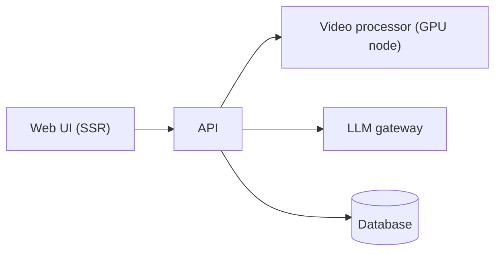

# Case: computer-vision product

A product that analyses movement in video: the user uploads a video and gets feedback generated by a language
model. Described abstractly here ("App A").

## Shape decisions

- The UI talks to the API over the in-cluster service, never the public domain.
- Heavy processing runs on a GPU node, called **only** by the API.
- The API goes through an LLM gateway that centralizes keys, limits and cost observability.
- Delivery follows the same flow as every app: PR, image, tag in the GitOps repository, sync.

## What this case illustrates

GPU workload isolation, internal network boundaries and the [GitOps](../architecture/gitops-pattern.md) pattern
applied to a product with more than one component.
