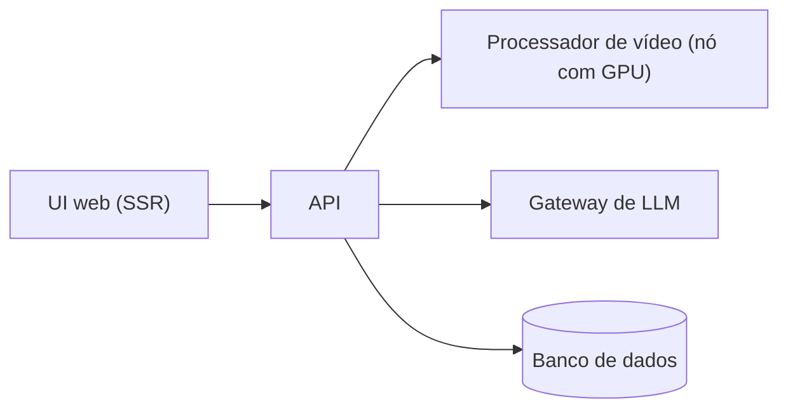

# Caso: produto de visão computacional

Um produto que analisa movimento em vídeo: o usuário envia um vídeo e recebe feedback gerado por um modelo de
linguagem. Descrito aqui de forma abstrata ("App A").

## Decisões de forma

- A UI fala com a API pelo serviço interno do cluster, nunca pelo domínio público.
- O processamento pesado roda num nó com GPU, chamado **apenas** pela API.
- A API passa por um gateway de LLM, que centraliza chaves, limites e observabilidade de custo.
- Entrega pelo mesmo fluxo de todos os apps: PR, imagem, tag no repositório GitOps, sincronização.

## O que este caso ilustra

Isolamento de carga de GPU, fronteiras de rede internas e o padrão [GitOps](../architecture/gitops-pattern.md)
aplicado a um produto com mais de um componente.
