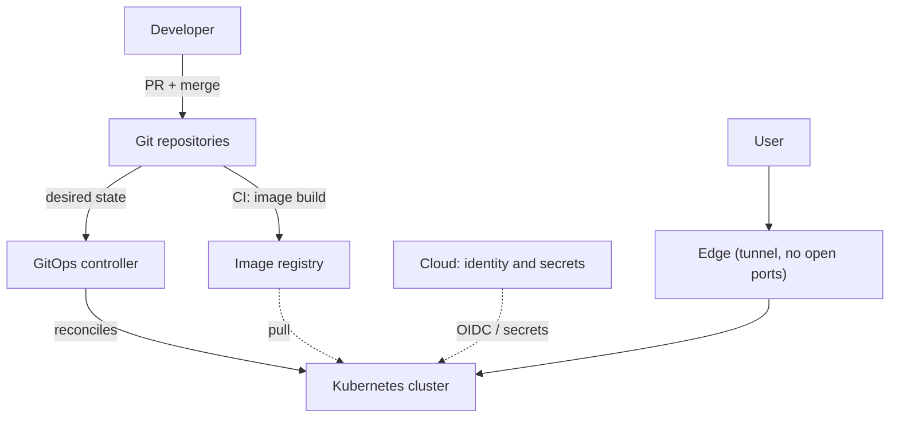

# Homelab platform: how and why

High-level notes on a personal platform run with production practices: real Kubernetes, infrastructure as
code, GitOps and pipelines with no static credentials.

This site shows **patterns, decisions with trade-offs and lessons learned**. The technical detail of each
component (configuration, endpoints, runbooks, roadmap) lives next to the code, in private repositories.

## In one picture

## Where to start

- **[Architecture](architecture/index.md)**: the layers and how they relate.
- **[Decisions](decisions.md)**: what was chosen, what was left out and what each choice costs.
- **[Lessons learned](lessons.md)**: what broke or surprised.
- **[Case studies](case-studies/computer-vision.md)**: real applications, described abstractly.

## Principles

- **Everything declarative.** Git is the only source of desired state.
- **No long-lived credentials.** Federated identity in CI and secrets injected at runtime.
- **Convention over configuration.** A repository's name already says what it does.
- **Docs next to the code.** Each repository documents itself; this site summarizes what is worth sharing.
