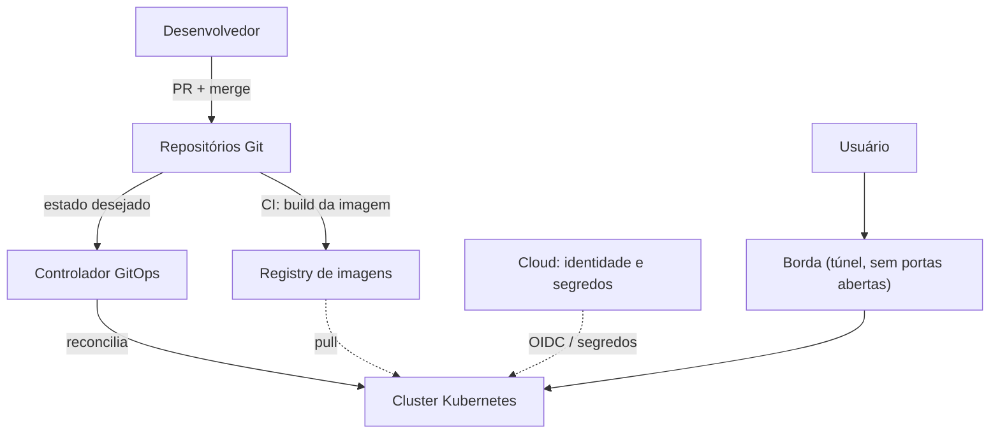

# Plataforma de homelab: como e porquê

Notas de alto nível sobre uma plataforma pessoal operada com práticas de produção: Kubernetes real,
infraestrutura como código, GitOps e pipelines sem credenciais estáticas.

Este site mostra **padrões, decisões com trade-offs e lições aprendidas**. Os detalhes técnicos de cada
componente (configuração, endpoints, runbooks, roadmap) vivem junto do código, em repositórios privados.

## Em uma imagem

## Por onde começar

- **[Arquitetura](architecture/index.md)**: as camadas e como se relacionam.
- **[Decisões](decisions.md)**: o que foi escolhido, o que ficou de fora e o custo de cada escolha.
- **[Lições aprendidas](lessons.md)**: o que quebrou ou surpreendeu.
- **[Casos de estudo](case-studies/computer-vision.md)**: aplicações reais descritas de forma abstrata.

## Princípios

- **Tudo declarativo.** O Git é a única fonte do estado desejado.
- **Sem credenciais de longa duração.** Identidade federada no CI e segredos injetados em runtime.
- **Convenção antes de configuração.** O nome de um repositório já diz o que ele faz.
- **Documentação junto do código.** Cada repositório documenta a si mesmo; este site resume o que vale compartilhar.
